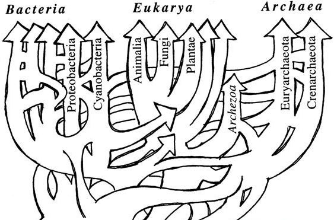
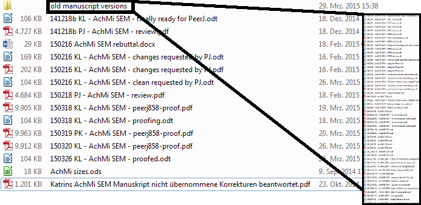
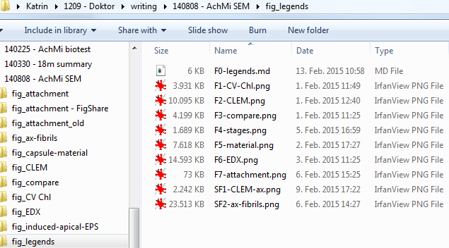
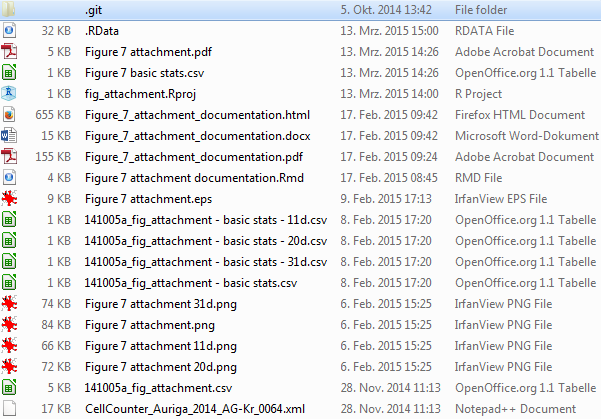

### Remember Ansgar's "Tree of Life"-talk?

### What is evolution? Inheritance of genetic changes.

[ Horizontal gene transfer: perspectives at a crossroads of scientific disciplines")](http://www.nature.com/nrmicro/journal/v3/n9/fig_tab/nrmicro1253_F1.html)

### Projects evolve, too! Largely digitally.

### Git helps track such changes in your project files.

> - automatic visualisation => What did I change?
> - [cryptographic verification](http://git-scm.com/book/en/v2/Getting-Started-Git-Basics#Git-Has-Integrity) => Nothing can change without notice!
> - commenting => What does the change mean?

### Git is your file watchdog.

### Good against: too many files

### Good against: unnamed versions

### Good for: tidy project folders, but...

### Good for: ...version history still accessible

### What is Git?

> [A] free and open source distributed **version control** \newline system designed to handle everything from small to very large projects with speed and efficiency. ([git-scm.com](http://git-scm.com/))

#### control over document versions

> - record changes, esp. in text files and software source code
> - also useful for images (JPG, PNG, etc.), but not complex files (DOC, XLS, PDF, etc.) 
> - revert old changes, per line if necessary
> - DEMO: `F0-legends` & `150224-30m`

### What is Git?

> [A] free and open source **distributed** version control \newline system designed to handle everything from small to very large projects with speed and efficiency. ([git-scm.com](http://git-scm.com/))

#### team-work

> - entire database of project history is stored in each project folder
> - sync changes via Git hosting service (like comments in JPY-PDF)
> - conflicts only for same line in same file
> - DEMO: `Paper-Now-Achmi...`

### Basic vocabulary

- **repository/repo:** Git's database of file versions in a watched folder

### Basic vocabulary

- **commit:** set of logically connected changes within same (or across different) file(s) that are checked into the repository

### Basic vocabulary

> - **.gitignore:** file that contains a repo's ignore rules
> - No highlighting? Large file? Auto-generated? Rather ignore those!
> - DEMO: `Git it on`

### Basic vocabulary

> - **staging area:** select changes to commit after files were saved to disk
> - add commit message & description
> - add .gitignore rules via context menu

### Advanced vocabulary

> - **branches:** different contexts in same repository
> - created for a side experiment & then either merged or deleted)

### Advanced vocabulary

> - **switching branches:** switch status of project folder (double-check!)
> - **merging:** integrates changes into other branch (even per line)
> - DEMO: `Git it on > experiments`

### Summary of Git's properties

#### Technical

> - works best for simple text & OK for images
> - makes file changes and their history comprehensible & verifiable 
> - gratis backup & syncing, but only for text & small image files

#### Cultural

> - enables precise documentation (for colleagues, students, reviewers, your future self, etc.)
> - eases team-work on same set of files

### How to start using it?

> 1. download client from [windows.github.com](https://windows.github.com/) (any other from [git-scm.com/downloads/guis](http://git-scm.com/download/gui/win)) & install
> 1. wait for new, small sub-project (bioinformatic script, diagram in R, report, etc.)
> 1. drag project folder into GitHub client to initialise the repo
> 1. edit, add & delete files as before
> 1. **but:** commit logically connected changes often
> 1. **recommended:** start writing text in .markdown or .txt, instead of .docx
> 1. **optional (for team-work, etc.):** wait for [git.uni.kn](https://git.uni-konstanz.de/users/sign_in) or create account at [GitLab](https://gitlab.com/users/sign_in), [GitHub](https://github.com/join), [BitBucket](https://bitbucket.org/account/signup/), etc. & push/sync your local repo

### Why not Git itself?

> - Git has only **c**ommand **l**ine **i**nterface
> - Git clients (like GitHub for Windows) present Git's functions nicely in **g**raphical **u**ser **i**nterface
> - Git hosting service offer remote copy to which local repo(s) can be sync'ed/pushed, plus discussion area, wiki, auto-publishing etc.

### Why not Git itself?

### Questions?

### Thanks to & Further Reading

- "[Scientific Markdown](https://github.com/JensErat/scientific-markdown)" by Jens Erat
- "[Git for Scientists](https://mollygibson.github.io/2014-08-11-wustl/lessons/git-notebook/git-for-scientists.slides.html)" by [Molly Gibson](https://github.com/mollygibson)
- "[Git/GitHub: a Primer for Researchers](http://datapub.cdlib.org/2014/05/05/github-a-primer-for-researchers/)" by [Carly Strasser](http://carlystrasser.net/)
- "[We Need a Github of Science](http://marciovm.com/i-want-a-github-of-science/)" by [Marcio von Muhlen](https://twitter.com/marciovm)
- "[10 Years of Git: An Interview with Git Creator Linus Torvalds](https://www.linux.com/news/featured-blogs/185-jennifer-cloer/821541-10-years-of-git-an-interview-with-git-creator-linus-torvalds/)" by [Jennifer Cloer](https://twitter.com/JenniferCloer)
- "[Learn Version Control with Git](http://www.git-tower.com/learn/ebook/mac/basics/why-use-version-control#start)" course by the makers of the "[Tower](http://www.git-tower.com/)" Git client
