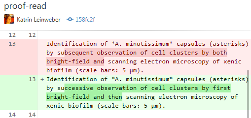
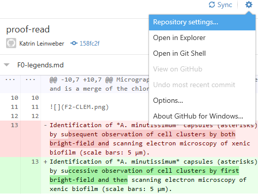

### What is evolution? Inheritance of genetic changes.

### Projects evolve, too! Largely digitally.

[ Horizontal gene transfer: perspectives at a crossroads of scientific disciplines")](http://www.nature.com/nrmicro/journal/v3/n9/fig_tab/nrmicro1253_F1.html)

### Git can help track the digital evolution of your project(s).

> - [cryptographic verification](http://git-scm.com/book/en/v2/Getting-Started-Git-Basics#Git-Has-Integrity) of files => All changes get noticed.
> - automatic visualisation => What was changed?
> - commenting => What does a change mean?

### Git is your file watchdog.

### Good against: too many files

### Good for: tidy project folders, but...

### Good for: ...version history still accessible

### Summary of Git's properties

#### Technical

> - treats text files on a line-by-line basis
> - also works for simple images, but not for complex or large file types

#### Cultural

> - makes file versions comprehensible & verifiable (for your future self, colleagues, students, reviewers…) => precise documentation
> - less painful team-work on same set of files
> - conflicts only if same lines in same get changed

### Basic Git vocabulary

> - **repository/repo:** project folder watched by Git
> - database of file versions in hidden `.git` subfolder \

### Basic Git vocabulary

> - **commit:** set of logically connected file changes
> - within single file or across different files
> - "checked into" the repo with a commit message \

### Basic Git vocabulary

> - **.gitignore:** file that contains a repo's rules for ignoring files
> - No highlighting? Large file? Auto-generated? Rather ignore those! \

> - DEMO: `Git it on`

### Basic Git vocabulary

### Basic Git vocabulary

> - **staging area:** select changes to commit after files were saved to disk
> - add commit message & description
> - set .gitignore rules via context menu

### Advanced Git vocabulary

> - **branching:** creates new "evolutionary" line in repo
> - switching branches updates status of project folder
> - **merging:** integrates changes into other branch (per line)
> - DEMO: `Git it on > experiments`

### Vocabulary summary

> - **repository/repo:** project folder watched by Git
> - **commit:** set of logically connected file changes
> - **.gitignore:** file that contains a repo's rules for ignoring files
> - **staging area:** select changes to commit after files were saved to disk
> - **branching:** creates new "evolutionary" line in repo

### How to start using it?

> 1. download client from [windows.github.com](https://windows.github.com/) (any other from [git-scm.com/downloads/guis](http://git-scm.com/download/gui/win)) & install
> 1. start with small sub-project (protocol optimisation, diagram in R, report, etc.)
> 1. drag & drop project folder into GitHub client to initialise the repo
> 1. edit, add & delete files as before
> 1. **but:** commit logically connected changes often
> 1. **recommended:** start writing in .markdown, for example with [Writage](http://www.writage.com/)
> 1. **optional (for team-work, etc.):** wait for [git.uni.kn](https://git.uni-konstanz.de/users/sign_in) or create account at [GitLab](https://gitlab.com/users/sign_in), [GitHub](https://github.com/join), [BitBucket](https://bitbucket.org/account/signup/), etc. & push/sync your local repo

### Git GUI vs. CLI.

### Questions?

### Thanks to & Further Reading

- "[Scientific Markdown](https://github.com/JensErat/scientific-markdown)" by Jens Erat
- "[Git for Scientists](https://mollygibson.github.io/2014-08-11-wustl/lessons/git-notebook/git-for-scientists.slides.html)" by [Molly Gibson](https://github.com/mollygibson)
- "[Git/GitHub: a Primer for Researchers](http://datapub.cdlib.org/2014/05/05/github-a-primer-for-researchers/)" by [Carly Strasser](http://carlystrasser.net/)
- "[We Need a Github of Science](http://marciovm.com/i-want-a-github-of-science/)" by [Marcio von Muhlen](https://twitter.com/marciovm)
- "[10 Years of Git: An Interview with Git Creator Linus Torvalds](https://www.linux.com/news/featured-blogs/185-jennifer-cloer/821541-10-years-of-git-an-interview-with-git-creator-linus-torvalds/)" by [Jennifer Cloer](https://twitter.com/JenniferCloer)
- "[Learn Version Control with Git](http://www.git-tower.com/learn/ebook/mac/basics/why-use-version-control#start)" course by the makers of the "[Tower](http://www.git-tower.com/)" Git client
