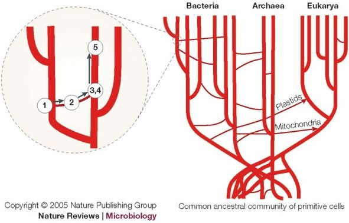

## What is Git?

> [A] free and open source distributed version control system designed to handle everything from small to very large projects with speed and efficiency. ([git-scm.com](http://git-scm.com/))

## What is Git?

> [A] free and open source distributed version control system designed to handle everything **from small to very large projects** with speed and efficiency. ([git-scm.com](http://git-scm.com/))

**You are already using products built with the help of Git**

> - originally built for Linux kernel development
  - thousands of people, millions of lines of code
> - used now by all major software products and companies (Android, Facebook, Google, Microsoft, Netflix, Twitter, etc.); both internally & publicly

## What is Git?

> [A] free and open source distributed version control system designed to **handle everything** from small to very large projects with speed and efficiency. ([git-scm.com](http://git-scm.com/))

**File type agnostic**

> - like good backup system: any file type can be checked in
> - line- or paragraph-based text works best
>   - software source code 

## What is Git?

> [A] free and open source distributed **version control** system designed to handle everything from small to very large projects with speed and efficiency. ([git-scm.com](http://git-scm.com/))

**control over document versions:**

> - recording & commenting changes
> - displaying change history
> - reverting old changes (line-by-line possible)

## What is Git?

> [A] free and open source **distributed** version control system designed to handle everything from small to very large projects with speed and efficiency. ([git-scm.com](http://git-scm.com/))

**asynchronous team-work**

> - entire database of project history is stored in project folder
>   - sync folder with Git server upload changes (like Adobe's comment syncing system in Journal of Phycology

## What is it good against? File creep!

## What is it good against? Version creep!

## What is it good for?

## Basic vocabulary [ ] Order differently?

- **repository** = Git's database of file versions in a watched folder

## Basic vocabulary

- **staging area** = selection of saved file changes disk already, but not yet committed to repository

## Basic vocabulary [ ] Order differently?

- **commit** = set of logically connected changes within same (or across different) file(s) that are checked into the repository

## Advanced vocabulary

> - **branches** = different contexts in same repository (cheaply created for a side experiment & then either merged or deleted)

> - **switching branches** = letting Git serve only the files in that branch to you
> - **merging** = integration of changes from one branch into another 

> *Source: [Horizontal-gene-transfer](https://commons.wikimedia.org/wiki/File:Horizontal-gene-transfer.jpg#/media/File:Horizontal-gene-transfer.jpg) by Dr. Smets and perhaps others - Barth F. Smets, Ph.D., with permission. Licensed under Attribution via Wikimedia Commons*

## How to start using it? 

> 1. Download a Git client (for example from windows.github.com, or check [git-scm.com/downloads/guis](http://git-scm.com/download/gui/win)) & install
> 1. create new folder initialise it as a repository
> 1. start adding files & editing them
> 1. commit logically connected edits and changes 
> 1. *Optional (collaboration, backup, publishing, etc): create account with a Git-hosting service like [GitLab](https://gitlab.com/users/sign_in), [GitHub](https://github.com/join), [BitBucket](https://bitbucket.org/account/signup/)*

## What to use Git for?

> - small, new projects (report, diagram in R

## What is it good for?

### Culturally

> - documenting your work (for colleagues, students, reviewers, your future self, etc.) 
> - collaborative work on same project / set of files

### Technically

> - line-based text files: scripts (problems only if same lines are edited)
> - version control (highlighting & cryptographic proof of changes)
> - (automatic) publishing (pre-prints, raw data, etc.)
> - gratis backup & cheap syncing on top

## The End

See also my [Introduction to Digital Lab Journalling](http://prezi.com/p_se6nkre49m/digital-lab-journalling-intro/).

